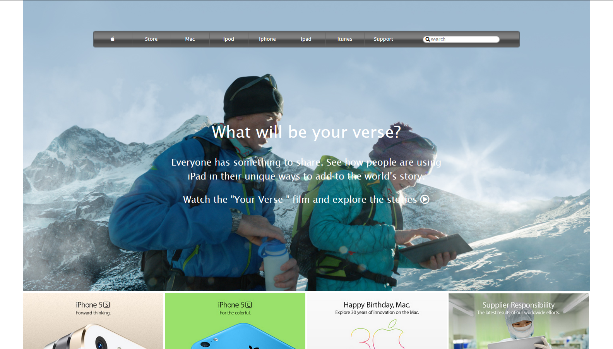

# Old Apple Page

> The Old Apple page, had many fundaments such as on how to use an image as a background, the use of gradient, and grid.

The project was created based on an Old site of Apple. We based our project on the site for the learning on how to use an image as a background as well as how to use gradients.

## Built With

- HTML5
- CSS3

## Live Demo

[Live Demo Link](https://rawcdn.githack.com/jcy2704/Old-apple/d4be6118eb8e619dba0a63a1882d4cf0e7dd93a9/index.html)

## Getting Started

**This project was created for the sole purpose of learning how to use CSS gradient and image as background. The following will be instructions on how you can see the project on your own computer.**

To get a local copy up and running follow these simple example steps.

### Prerequisites
Computer running Mac OS, Windows, or Linux Ubuntu.
Internet browser: Firefox, Google Chrome, Opera...

### Setup
Download the code or copy the git repository to your computer.

### Usage
Run the index.html file.

### Run tests
Linters errors

## Authors

👤 **Steven Jack Chung**

- GitHub: [@jcy2704](https://github.com/jcy2704)
- Twitter: [@yiak_](https://twitter.com/yiak_)
- LinkedIn: [Steven Jack Chung](https://linkedin.com/in/stevenjchung)

👤 **Mir Rawshan Ali**

- GitHub: [@sumon0002009](https://github.com/sumon0002001)
- Twitter: [@sumon0002009](https://twitter.com/Sumon0002009)
- LinkedIn: [Mir Rawshan Ali](https://www.linkedin.com/in/mir-rawshan-ali-27b6a5198/)

## 🤝 Contributing

Contributions, issues, and feature requests are welcome!

Feel free to check the [issues page](https://github.com/jcy2704/Old-apple/issues).

## Show your support

Give a ⭐️ if you like this project!

## Acknowledgments

- Hat tip to anyone whose code was used
- Inspiration
- New York Times
